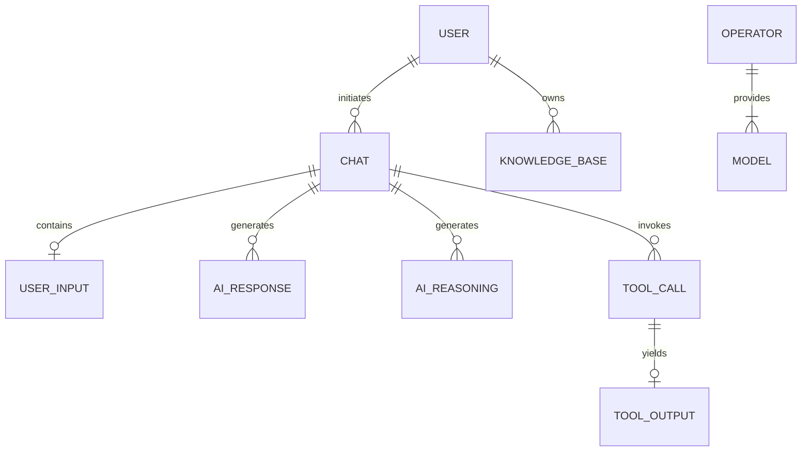

# Domain Model Guide

## 1. Domain Summary
The Peng Agent domain revolves around an AI conversation system (Chat) where Users interact with various AI Operators (Providers) and Models. The system tracks not just the conversation text, but the precise reasoning steps, tool invocations, and tool outputs generated by the AI agent during a chat session.

## 2. Glossary of Domain Terms
- **Operator**: An AI service provider or runtime environment (e.g., OpenAI, Anthropic, Ollama).
- **Model**: A specific AI model offering provided by an Operator (e.g., `gpt-4o`, `claude-3-5-sonnet`).
- **Chat**: A single conversational exchange or task execution initiated by a User.
- **Reasoning**: Internal thought processes exposed by certain advanced models (e.g., `o1`, `deepseek-r1`) before generating a final response.
- **Knowledge Base (RAG)**: A collection of user-uploaded documents used to ground the AI's responses via Retrieval-Augmented Generation.

## 3. Main Entities/Concepts
1. **User**: Represents a human account. Stores authentication data, S3 keys for personal file uploads, and a JSON-serialized list for `long_term_memory`.
2. **Operator**: Defines API endpoints, keys, and regex patterns used to classify which models handle text, embeddings, or multimodal inputs.
3. **Model**: Defines capabilities (booleans for `input_text`, `output_image`, etc.) and the `reasoning_effect` type.
4. **Chat**: The root entity for an interaction. Tracks `human_input`, the `base_model` used, the attached `knowledge_base`, and user `feedback`.
5. **UserInput**: The detailed breakdown of the human's prompt, including image locations.
6. **AIResponse**: The final text blocks generated by the agent.
7. **AIReasoning**: The internal thought blocks generated by the agent.
8. **ToolCall**: A record of the agent deciding to invoke an external function, including arguments.
9. **ToolOutput**: The execution result of the invoked tool.
10. **KnowledgeBase**: Metadata for uploaded RAG documents.

## 4. Entity Relationships (Mermaid Diagram)

## 5. Key Business Workflows
- **Chat Execution Loop**: When a user sends a message, a `Chat` and `UserInput` record are created immediately. The `PengAgent` LangChain/LangGraph instance is invoked. As the agent streams back data, the system parses the chunk types (`output_text`, `reasoning_summary`, `tool_call`, `tool_output`). When a chunk type switches or the stream ends, the accumulated buffer is flushed to the respective MySQL table (`AIResponse`, `AIReasoning`, `ToolCall`, `ToolOutput`).
- **User Creation**: Requires an `admin_password` matching the server config. Passwords are bcrypt hashed. A Redis cache record is created alongside the database entry. A non-expiring `api_token` (JWT) is generated automatically.

## 6. Invariants that must be preserved
- **String Truncation Limits**: To prevent database overflow crashes, `human_input` is strictly truncated to `4096` characters. `AIResponse`, `AIReasoning`, and `ToolOutput` strings are strictly truncated to `10240` characters before database insertion.
- **Single Source of Auth Truth**: Users are identified by `user_name` (which must be unique).
- **Binary Data Exclusion**: The system explicitly checks if a `ToolOutput` is binary image data (e.g., `bytes` or starting with `b'`). If it is, it skips saving it to the database to prevent MySQL blob corruption.

## 7. Validation Rules
- Enforced primarily by Pydantic models (e.g., `ChatRequest`, `UserCreate`).
- During signup, if a user provides an empty password, a 16-byte cryptographically secure random token is generated.

## 8. Authorization Rules
- Endpoints use `Depends(authenticate_request)`. The JWT is parsed to extract the `sub` (username). If the token has expired, `401` is returned.
- Feedback updates (`/chat_feedback`) verify that the `user_name` in the payload matches the `username` extracted from the JWT to prevent users from altering others' feedback.

## 9. Important Calculations/Transforms
- The chat handler groups consecutive SSE stream chunks of the same type (e.g., multiple `reasoning` chunks) into a single large string buffer (`full_response`), only committing to the database when the agent shifts to a new mode (e.g., shifting from reasoning to final text output).

## 10. Duplicated Rules across Server/Web/Mobile
- The allowed feedback states (`"upvote"`, `"downvote"`, `"no_response"`) are duplicated across the backend Pydantic model and the frontend TypeScript interfaces.

## 11. Edge Cases Handled
- Malformed chunks during chat streaming are silently ignored.
- Token expiration: `api_token` generated at user creation has infinite expiration, whereas standard login tokens expire in 7 days.

## 12. Edge Cases Missing/Under-Tested
- Database truncation (10,240 chars) happens silently. If an AI writes a large coding script that exceeds this, the database loses the tail end of the script, preventing exact reconstruction of the chat history.

---

## Domain Rules Table

| Domain rule | Source files | Enforced in | Risk if changed |
|---|---|---|---|
| AI output DB truncation (10240 chars) | `chat_handlers.py` | MySQL Insert Logic | DB crashes if removed; data loss if kept. |
| Skip saving binary tool output | `chat_handlers.py` | Chunk parsing logic | MySQL `Text` column encoding crash. |
| Feedback user matching | `chat_router.py` | Route validation | Users could upvote/downvote others' chats. |
| Infinite expiration for API tokens | `auth_handlers.py` | `create_access_token` | Breaking programmatic/agentic API access. |
